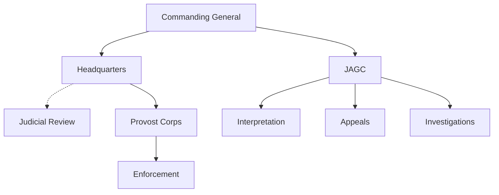

# §6. Command and Reporting

## Chain of Command
Issues must follow chain from lowest competent authority.

## Reporting Protocol
Incidents must be logged through proper channels.

```mermaid
graph TD
    A[Headquarters]
    A1[Judicial Review]
    B[Provost Corps]
    B1[Enforcement]
    C[Commanding General]
    G[JAGC]
    G1[Interpretation]
    G2[Appeals]
    G3[Investigations]

    C-->A
    A-->B
    A-.->A1
    B-->B1
    C-->G
    G-->G1
    G-->G2
    G-->G3
```